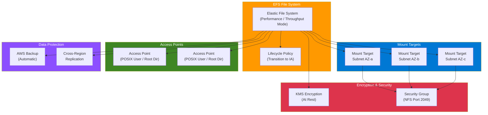

# terraform-aws-efs

Terraform module to provision an AWS Elastic File System (EFS) with mount targets, access points, replication, and backup policy.

## Architecture Diagram



## Features

- EFS file system with configurable performance and throughput modes
- Encryption at rest enabled by default (with optional custom KMS key)
- Mount targets across multiple subnets
- Configurable access points with POSIX user and root directory settings
- Automatic backup policy
- Cross-region replication support
- Dedicated NFS security group with VPC CIDR ingress

## Usage

### Basic

```hcl
module "efs" {
  source = "github.com/kogunlowo123/terraform-aws-efs"

  name       = "my-efs"
  vpc_id     = "vpc-0123456789abcdef0"
  subnet_ids = ["subnet-abc", "subnet-def"]

  tags = {
    Environment = "dev"
  }
}
```

### With Access Points and Replication

```hcl
module "efs" {
  source = "github.com/kogunlowo123/terraform-aws-efs"

  name             = "my-efs"
  vpc_id           = "vpc-0123456789abcdef0"
  subnet_ids       = ["subnet-abc", "subnet-def"]
  lifecycle_policy = "AFTER_30_DAYS"

  access_points = {
    data = {
      path = "/data"
      posix_user = {
        gid = 1000
        uid = 1000
      }
      root_directory = {
        path = "/data"
        creation_info = {
          owner_gid   = 1000
          owner_uid   = 1000
          permissions = "755"
        }
      }
    }
  }

  enable_replication             = true
  replication_destination_region = "us-west-2"

  tags = {
    Environment = "production"
  }
}
```

## Requirements

| Name | Version |
|------|---------|
| terraform | >= 1.0 |
| aws | >= 5.0 |

## Inputs

| Name | Description | Type | Default | Required |
|------|-------------|------|---------|----------|
| name | Name of the EFS file system | `string` | n/a | yes |
| vpc_id | VPC ID for the EFS security group | `string` | n/a | yes |
| subnet_ids | List of subnet IDs for mount targets | `list(string)` | n/a | yes |
| performance_mode | File system performance mode | `string` | `"generalPurpose"` | no |
| throughput_mode | Throughput mode for the file system | `string` | `"bursting"` | no |
| provisioned_throughput | Provisioned throughput in MiB/s | `number` | `null` | no |
| encrypted | Enable encryption at rest | `bool` | `true` | no |
| kms_key_arn | ARN of KMS key for encryption | `string` | `null` | no |
| lifecycle_policy | Transition to IA storage class policy | `string` | `null` | no |
| security_group_ids | Additional security group IDs for mount targets | `list(string)` | `[]` | no |
| access_points | Map of access point configurations | `map(object)` | `{}` | no |
| enable_backup | Enable automatic backups | `bool` | `true` | no |
| enable_replication | Enable cross-region replication | `bool` | `false` | no |
| replication_destination_region | Destination region for replication | `string` | `null` | no |
| tags | Map of tags to apply to all resources | `map(string)` | `{}` | no |

## Outputs

| Name | Description |
|------|-------------|
| file_system_id | The ID of the EFS file system |
| file_system_arn | The ARN of the EFS file system |
| file_system_dns_name | The DNS name of the EFS file system |
| mount_target_ids | Map of subnet ID to mount target ID |
| mount_target_dns_names | Map of subnet ID to mount target DNS name |
| mount_target_network_interface_ids | Map of subnet ID to mount target ENI ID |
| access_point_ids | Map of access point key to access point ID |
| access_point_arns | Map of access point key to access point ARN |
| security_group_id | The ID of the EFS security group |
| security_group_arn | The ARN of the EFS security group |

## Examples

- [Basic](examples/basic/) - Minimal EFS setup with mount targets
- [Advanced](examples/advanced/) - EFS with access points and lifecycle policy
- [Complete](examples/complete/) - Full-featured EFS with replication, KMS encryption, and provisioned throughput

## License

MIT License. See [LICENSE](LICENSE) for details.
